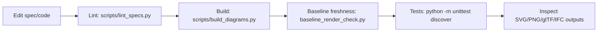

# Development

This guide is for maintainers and contributors. It consolidates the relationship-first architecture, solver behaviours, IFC alignment, and day-to-day workflows. Keep `docs/instructions.md` nearby when authoring specs; use `dev/roadmap.md` for tasks.

```mermaid
flowchart TD
  A[Spec YAML \n (schema: pond-relationship*)] --> B[Schema loader \n axis-map parse + size inference]
  B --> C[Relationship solver \n CadQuery solids + diagnostics]
  C --> D[Planner \n footprints + slices]
  D --> E[Renderers \n SVG/PNG]
  C --> F[Exports \n glTF/GLB, IFC, STEP/OBJ]
  C --> G[Orthographic snapshot \n (optional)]
```

## Codebase map

- `diagramming/` – engine entry point.
  - `relationships/` – relationship-first loader, solver, lint helpers, and IFC exporter glue.
  - `planner/` – turns solved solids into plan/section bundles and dimensions.
  - `renderers/` – SVG styling and emission.
  - `materials.py` – palette for SVG/glTF colours.
- `diagrams/specs/` – author-facing YAML specs; long-lived revisions belong in `archive/diagrams/specs/`.
- `scripts/` – CLI entry points (`build_diagrams.py`, `lint_specs.py`, `baseline_render_check.py`, `check_water_area.py`).
- `diagramming/tests/` – unittest suite and fixtures.
- `docs/` – authoring instructions; archived references move under `archive/`.

## Relationship-first pipeline

- **Schema loader**: axis-map `relate` blocks keyed by subject axes (`+x`, `-x+y`, `cx`, `~x`, etc.) resolve to targets with `ref`/`pos`/`gap`/`offset`/`mode`. `flush` sugar expands to axis-map entries; per-placement `place` blocks embed axis-maps directly. Frames (`world`/`local`/`component:<id>`) drive placement; relations honour the chosen frame while preserving gaps/offsets and size inference.
- **Arrays**: `array` (legacy alias: `run_between`) supplies `start`/`end` axis-maps; `orient: along_run` aligns +X to the span and interpolates size from paired faces. Missing axes fall back to component-level relates; lint enforces `count >= 2` with solver warnings for single-span requests. Run instances (`base#n`) are valid refs/selectors.
- **Operations & selectors**: typed `operations` (`rotate`, `mirror`, `translate`, `boolean`) accept selectors (`id`, `id.original`, `id.clones`). Rotations remap numbered clones; mirror reflects across axis-aligned planes while keeping orientations right-handed.
- **Size inference & references**: components infer missing sizes from axis pairs; conflicts with explicit size lint. `kind: reference` components are geometry-less anchors with missing axes defaulting to 0.
- **Checks & diagnostics**: checks reuse axis-map shapes and now honour `tolerance` + `on_fail: warn|error|ignore`; DOF reporting warns only when an axis can’t infer a position or size (remaining DOF), while explicit spans + sizes are permitted so long as they agree. Collisions report via OCC; severity driven by `DIAGRAM_RELATIONSHIPS_COLLISIONS=error|warn|ignore` (default `error`) with `DIAGRAM_RELATIONSHIPS_FAIL_ON_WARN=1` to promote warnings; `--collision-mode/--collision-ignore/--fail-on-warn` on the CLI set these without touching the environment. Footings (`IfcFooting`) are ignored in collision pairs by default (even when a custom ignore list is supplied) to keep pad supports from flooding reports.
- **Planner & renderers**: relationship planner projects footprints/section slices from solids and emits dimension polylines; renderers share styling with the legacy path.
- **Exporters**: tessellated glTF/GLB with metadata in `extras`; IFC 4.3 Reference View (mm/deg units, Model/Axis/Body contexts, predefined-type/material expectations, mapped items/types for repeats, RelVoids propagated to clones); STEP/OBJ reuse CadQuery solids.

## Architecture details (canonical surfaces)

- Schema loader: axis-map `relate` entries keyed by subject axes with `ref`/`pos`/`gap`/`offset`/`mode`; frames (`world`/`local`/`component:<id>`) are applied during placement, including `flush` expansion. Center tokens (`cx`, `cy`, `cz`, `~x`, etc.) are valid in keys/targets. `flush` sugar expands to axis-map entries (`faces: all` default; scalar or per-face inset). `place` embeds per-placement axis-maps directly (no nested `relate`).
- Arrays: `array` (alias `run_between`) accepts component/reference targets and axis-map `start`/`end` blocks; `orient: along_run` aligns local +X to the 3D span and can infer/interpolate size from paired faces. Multi-axis tokens (e.g., `-x+y`) anchor true points in `mode: point` (default).
- Components: solids or `kind: reference` anchors; references default missing axes to 0. Missing component size axes infer from relation pairs; conflicts lint unless matched. Aggregate selectors (`id`, `id.original`, `id.clones`) are accepted wherever component lists appear. Typed `operations`: `rotate`, `mirror`, `translate`, `boolean`; rotation remaps numbered instances.
- Constraint solver: expands placements/arrays/selectors into explicit instances with deterministic GUID seeds. Resolves axis-map relations with size inference, applies run spans, executes typed operations, and reports OCC collisions (severity via `DIAGRAM_RELATIONSHIPS_COLLISIONS`). Diagnostics capture errors/warnings and shallow DOF notes; checks assert coordinate equality only (no tolerance/on_fail).
- Planner/renderers: RelationshipPlanner projects plan footprints and section slices from solver primitives, deriving dimension polylines from solved extents. GeometryBundle carries polygons/polylines, legend data, and the canonical `trimesh.Scene`; SVG renderer consumes bundles, PNG via cairosvg when available.
- Exporters: glTF/GLB via tessellated solids with metadata in `extras` (mm→m); IFC 4.3 Reference View with Model/Axis/Body contexts, class/predefined-type/material mapping, mapped items/types for repeated members, openings via `IfcRelVoidsElement` (propagated to clones), deterministic GUIDs; STEP/OBJ reuse CadQuery solids. `scripts/build_diagrams.py` orchestrates exports; `scripts/lint_specs.py` runs schema + solver + IFC validation and emits mesh digests.

## Spec authoring notes

- Specs (`diagrams/specs/deck-framing.yaml`, `diagrams/specs/edge-attachments.yaml`) set per-option metadata (`title`, `aria_label`, variant parameters) and a spec-level `scale` for comfortable sizing.
- Views may declare slicing planes (`views.<name>.plane.axis`/`coordinate`) for sections; only components listing the view name are included. Per-view overrides (`pad`, `scale`, `background`) tighten layout without affecting siblings.
- Components accept `height`, `material`, and `metadata.elevation` to drive 2.5D geometry and colour palettes; omit to keep planar. Legends auto-generate from labels across plan/section views.
- Linear repeats accept `direction`/`interval`/`span` helpers; planner normalises vectors and derives counts/spacing. Operations (`rotate`, `mirror`, `translate`, `boolean`) run after base geometry resolves; set `include_generated: true` only when transforming previously created clones. Rectangles may declare `boolean.subtract` targets for declarative cutouts (planner unions repeats/rotations automatically).
- Keep specs declarative: use axis-map relates and `array` spans for placement; prefer center tokens to avoid conflicting inference. See `docs/instructions.md` for concise axis-map examples.

## Current state and gaps

Pulled from the latest implementation review:

- Frames are honoured for axis-map/flush; monitor non-orthogonal use until richer DOF/tolerance handling lands.
- Checks enforce equality only; `tolerance`/`on_fail` semantics are not honoured.
- Helper coverage is limited to axis-map `relate`/`flush`/`place` plus `array`/`run_between`; `relate_from` and assemblies have been removed.
- IFC mapping table enforcement now covers predefined type/material usage, mapped items/types, and cloned openings across exporter/lint/validation.
- Collision reporting exists, but DOF counts and richer diagnostics are shallow.

## IFC alignment (working rules)

Target: IFC 4.3.2 Reference View; project units are millimetres and degrees.

- Contexts: one 3D Model context with Axis and Body subcontexts; optional plan footprints when helpful. Each product gets an `IfcLocalPlacement` (Z up, +X forward).
- Entity mapping highlights: joists/beams → `IfcBeam` (`predefined_type` JOIST/BEAM); blocking/bridging → `IfcMember`; decking → `IfcSlab` (`predefined_type: FLOOR`); openings → `IfcOpeningElement` linked via `IfcRelVoidsElement`; fasteners → `IfcFastener`/`IfcMember` as appropriate.
- Material usage: linear members prefer `IfcMaterialProfileSet(Usage)`; slabs use `IfcMaterialLayerSet(Usage)` with AXIS3 up. Repeated members should map to `IfcMappedItem`/`Ifc*Type` when profiles are uniform.
- Geometry conventions: Axis reps align to local +X; extrusions rise along +Z unless a non-vertical sweep is declared.

| Authoring intent             | IFC entity                   | PredefinedType                      | Material/representation notes                                                                    |
| ---------------------------- | ---------------------------- | ----------------------------------- | ------------------------------------------------------------------------------------------------ |
| Joists                       | `IfcBeam`                    | `JOIST`                             | Axis + Body; `IfcMaterialProfileSetUsage`; map repeats via `IfcMappedItem` where profiles match. |
| Inner/outer beams            | `IfcBeam`                    | `BEAM` (or `EDGEBEAM` as supported) | Axis + Body; `IfcMaterialProfileSetUsage`.                                                       |
| Blocking/bridging            | `IfcMember`                  | as needed                           | Axis + Body; `IfcMaterialProfileSetUsage`.                                                       |
| Straps/hangers (if modelled) | `IfcFastener` or `IfcMember` | —                                   | Body-only acceptable; simple `IfcMaterial`.                                                      |
| Decking                      | `IfcSlab`                    | `FLOOR`                             | Body (extrusion); `IfcMaterialLayerSet(Usage)` when layered.                                     |
| Pond voids                   | `IfcOpeningElement`          | `OPENING`                           | Reference + Body; linked via `IfcRelVoidsElement` to host.                                       |

## Commands and workflows



- Install/venv: `python3 -m venv .venv && source .venv/bin/activate && python3 -m pip install -r requirements.txt`.
- Lint: `python scripts/lint_specs.py --relationship-only` (runs solver + IFC validation, selector/coverage checks, collision reporting, mesh digests). Use `--legacy-only` to isolate legacy specs.
- Build: `python scripts/build_diagrams.py --spec diagrams/specs/deck-framing.yaml --option A --outdir diagrams/output --force` with flags `--no-png`, `--no-gltf`, `--no-ifc`, `--gltf-format gltf`, `--orthographic`; `--step`/`--obj` emit additional exports when the CadQuery solver is active.
- Baseline freshness: `./.venv/bin/python scripts/baseline_render_check.py --fresh-check` whenever you inspect rendered output; include a short note (“baseline render check passed…”) in logs.
- Tests: `python -m unittest discover`. Useful spot checks: `diagramming/tests/test_layering_debug.py` (layering regressions), `scripts/check_water_area.py <spec> --option <key>` (water coverage sanity).

## Authoring dos and don'ts

- Do prefer axis-map relates, `flush`, and `array` spans over manual coordinates; use center tokens for symmetric anchors.
- Do keep specs and materials in sync; add new material keys to `diagramming/materials.py`.
- Do document new helpers/ops with fixtures and update `DEVELOPMENT.md`/`architecture-spec.md` when behaviour changes.
- `relate_from` and assemblies have been removed to reduce surface area; specs should stick to axis-map `relate`/`flush`/`place` and `array`.
- Don't hand-edit generated artefacts; regenerate outputs instead.

## Notes on legacy path

`DIAGRAM_RELATIONSHIPS=0` forces the legacy anchor planner for archived specs. The relationship-first pipeline is canonical; legacy helpers (`flush_bundle`, `contact`, etc.) are retained only for history and will be removed once the teardown tasks in `dev/roadmap.md` land.

## References and further reading

- `architecture-spec.md` – component breakdown of the relationship-first stack.
- `docs/instructions.md` – quick-reference for editing relationship specs.
- `archive/` – historical examples and superseded reports.
- `dev/roadmap.md` – task tracker (active/in-flight/backlog).
