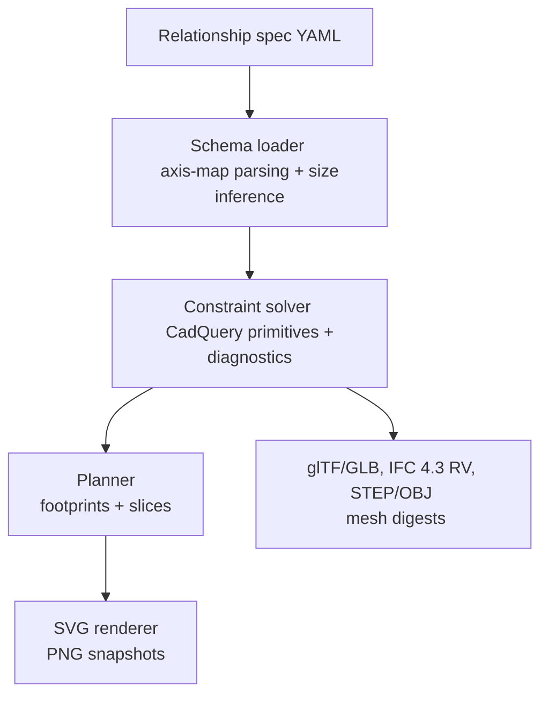

# Pond diagramming – architecture

This repo now centres on a relationship-first constraint solver that emits CadQuery-backed solids and feeds every exporter. Legacy anchors remain only for archived specs.

## Schema loader

- Axis-map `relate` entries keyed by subject axes with `ref`/`pos`/`gap`/`offset`/`mode`; frames parse (`world`/`local`/`component:<id>`) but are solved in world space today. Center tokens (`cx`, `cy`, `cz`, `~x`, etc.) are valid in keys/targets.
- `flush` sugar expands to axis-map entries (`faces: all` default, scalar or per-face inset). `place` embeds per-placement axis-maps directly (no nested `relate`).
- `run_between` arrays accept component/reference targets and axis-map `start`/`end` blocks; `orient: along_run` aligns local +X to the 3D span and can infer/interpolate size from face pairs. Multi-axis tokens (e.g., `-x+y`) anchor true points in `mode: point` (default).
- Components may be solids or `kind: reference` anchors; references default missing axes to 0. Missing size axes on components are inferred from relation pairs; conflicts lint unless matched. Aggregate selectors (`id`, `id.original`, `id.clones`) are accepted wherever component lists appear.
- Typed `operations` include `rotate`, `mirror`, `translate`, and `boolean`; rotation remaps numbered instances. `relate_from` and assemblies parse but do not expand (planned removal/reevaluation). Mirror is not yet implemented.

## Constraint solver

- Expands placements, arrays, and selectors into explicit instances with deterministic GUID seeds. Resolves axis-map relations with size inference, applies run spans, and executes typed operations. Collision detection uses OCC; severity follows `DIAGRAM_RELATIONSHIPS_COLLISIONS`.
- Diagnostics capture errors/warnings, degree-of-freedom notes (shallow today), and check results. Checks reuse the axis-map vocabulary but currently assert coordinate equality only (no tolerance/on_fail).
- Emits neutral primitives (box/wedge/sweep) with stored footprints/meshes for downstream planners and exporters.

## Planner & renderers

- RelationshipPlanner projects plan footprints and section slices from solver primitives, deriving dimension polylines from solved extents. GeometryBundle carries polygons/polylines, legend data, and the canonical `trimesh.Scene`.
- SVG renderer consumes bundles; PNG snapshots use cairosvg when available. Styling is shared across relationship and legacy paths.

## Exporters

- glTF/GLB via tessellated solids with metadata in `extras` (mm converted to m). Optional orthographic snapshot via pyrender/pyglet.
- IFC 4.3 Reference View: mm/deg units, Model/Axis/Body contexts, class/predefined-type/material mapping, openings via `IfcRelVoidsElement`, deterministic GUIDs. Lint currently enforces a minimal subset; mapped-item/material-usage rules remain to be implemented.
- STEP/OBJ reuse CadQuery solids (OBJ tessellated fallback). `scripts/build_diagrams.py` orchestrates exports; `scripts/lint_specs.py` runs schema + solver + IFC validation and emits mesh digests.

## Known gaps and priorities

- Frame-aware placement is not yet solved; all relations run in world space.
- Checks lack tolerance/on_fail semantics and richer DOF reporting.
- Helper parity: `relate_from`, assemblies, and mirror transforms parse but do not execute. `run_between` rename to `array` and guardrails (`count >= 2`) remain.
- IFC linting is minimal relative to the target mapping table (entity/type/material usage, mapped items, clone propagation) and needs hardening.
- Collision/boolean robustness and clone selector semantics still need regression coverage.
