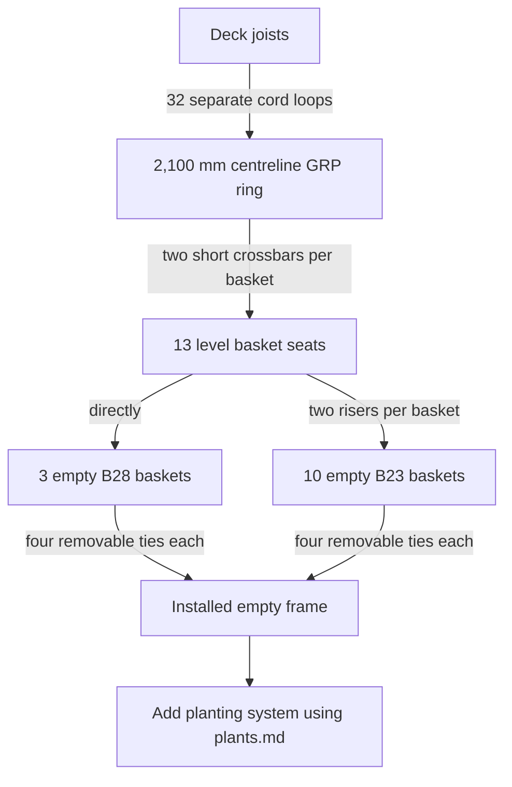

# R3 planting-rail build guide

## What this guide is for

This is the practical guide for buying, checking, making and installing the R3
submerged planting rail and its **empty** baskets. It assumes general workshop
competence and an introductory understanding of loads, supports and tolerances;
it does not assume experience with GRP, pond fittings or ropework.

Use [rail.md](rail.md) for the design history and calculations. After the empty
rail and baskets have been installed and accepted, use [plants.md](plants.md)
to add media, internal pots, fish guards and plants.

R3 is still at survey-and-prototype status. The dimensions below define the
intended system, but the sample baskets, site survey and proof tests are hold
points. Do not cut all repeated parts until the first one has fitted and passed.
The rail supports plants only; never stand, sit or climb on it.

## The arrangement in plain language

Four lengths of 38 mm grey structural GRP form a square ring under the deck
edge. Short cord loops hang the ring from every joist around the opening. Each
plant basket bridges across the ring on two smaller GRP bars. A small B23
basket also sits on two short risers so that its rim finishes at about the same
water depth as the taller B28 basket.

The target basket-bearing surface is about 200 mm below the **lowest normal
water level**. The top of the main ring is one 25 mm crossbar lower, at about
225 mm. The continuous ring should therefore be difficult to see; only the
short bars immediately below dark baskets are shallower.

## Terms used in this guide

| Term | Meaning here |
| --- | --- |
| Main ring or spine | The continuous square made from 38 mm GRP box section. “Spine” simply means the main member carrying the local basket supports. |
| Centreline square | The dimension between the centrelines of opposite 38 mm members, not their outer faces. |
| Crossbar | One short 25 mm GRP box section laid across the top of the main ring. Two support each basket. |
| Basket seat | The two crossbars, and for a B23 the two risers, supporting one basket. |
| Riser | A short piece of 38 mm GRP laid on a crossbar to raise a B23. |
| Basket-position sheet | A simple plan listing each basket name, size, side, distance along the rail, crossbar spacing and lowering bay. This replaces the phrase “station schedule”. |
| Main support loop | One closed 6 mm polyester cord loop between a joist and the main ring. |
| Location collar | A tight 3–4 mm cord binding immediately to either side of a main support loop, stopping its lower end from sliding along the ring. It does not carry the hanging load. |
| Keeper | A small screw and washer near a joist end which stops a cord loop walking off. It does not carry the hanging load. |
| Chafe protection | Smooth tube, tubular webbing or a shaped pad put between cord and a hard edge so repeated movement cannot saw through the cord. |
| Movement stop | A small rounded block tied immediately beside a crossbar if its binding alone allows it to slide. It is a fence, not the vertical support. |
| Load-spreading loop | Short smooth webbing or sleeving passing through several adjacent basket-mesh openings so one thin plastic cell does not take the whole tie force. |
| MBL | The manufacturer's published minimum breaking load for new cord. It is not the permitted working load of a knotted, wet installation. |
| A4/316 | Marine-grade stainless-steel fastener material. Do not substitute zinc-plated or galvanised parts in the pond. |

## Dimensions which define R3

| Item                        | R3 dimension or rule                                                                                             |
| --------------------------- | ---------------------------------------------------------------------------------------------------------------- |
| Pond                        | Nominally 3,000 × 3,000 mm internally; survey the finished liner faces.                                          |
| Finished deck opening       | Nominally 2,300 × 2,300 mm.                                                                                      |
| Deck overhang               | 350 mm from pond wall to deck edge.                                                                              |
| Main-ring centreline        | 450 mm from each pond wall, therefore 100 mm beyond the deck edge.                                               |
| Main-ring centreline square | 2,100 × 2,100 mm.                                                                                                |
| Main-ring outside size      | About 2,138 × 2,138 mm using 38 mm section.                                                                      |
| Mitred side cut             | Nominally 2,138 mm long-point to long-point to make the 2,100 mm centreline square. Confirm on the trial corner. |
| Basket bearing depth        | Measured B28 height + 10 mm below minimum normal water; nominally 200 mm.                                        |
| Main-ring top depth         | Basket bearing depth + measured crossbar depth; nominally 225 mm.                                                |
| B23 riser height            | Measured B28 height minus measured B23 height; nominally 38–40 mm.                                               |
| B23 riser length            | About 140 mm, then adjusted to the reinforced area of the measured base.                                         |
| Main support spacing        | One at every straight joist; no unsupported internal span above about 420 mm.                                    |

Do not move the main ring onto a joist line. The 450 mm offset is chosen for
plant light: a centred 150 mm internal pot clears the deck edge by about 25 mm.
The cords are allowed to slope between the actual joists and the planting line.

## Buying list

Quantities include the whole R3 rail and thirteen empty basket seats. They do
not include planting media, internal pots, lids or plants, which are scheduled
in [plants.md](plants.md).

### Structural parts

| Buy | Quantity | Specification and note |
| --- | ---: | --- |
| Main GRP box section | **2 × 6 m** | Grey pultruded structural GRP SHS, **38 × 38 × 5 mm**. Grey 38 × 38 × 3.2 mm may be substituted if available. Confirm structural grade and permanent-water suitability. |
| Crossbar GRP box section | Provisionally **1 × 6 m** | Grey pultruded structural GRP SHS, **25 × 25 × 3 mm**. Buy only after totalling the sample-basket cut lengths and saw kerfs; one length is close to the expected requirement. |
| Flat GRP sheet for corners | At least **400 × 800 × 6 mm** | Structural plate with documented properties in both in-plane directions, plain rather than decorative or anti-slip. This cuts into eight 170 × 170 mm L-shaped plates. If it is pultruded, the supplier must approve the cross-axis use and each top/bottom pair is oriented with strong directions at 90 degrees. |
| Corner bolts | **16** | M6 × 70 mm A4/316 through-bolts as the buying allowance. Confirm the exact length on a trial stack of two 6 mm plates plus 38 mm tube, washers and nut. |
| Large flat washers | **32** | A4/316, one beneath every bolt head and nut. |
| Locknuts and thread covers | **16 of each** | A4 all-metal locknuts; smooth pond-safe caps or a cured protective fillet over any projecting fish-facing thread. |
| B23 baskets | **10** | Rigid fine-mesh aquatic basket, nominally 230 × 230 × 150 mm. |
| B28 baskets | **3** | Rigid fine-mesh aquatic basket, nominally 270–280 mm square × 180–190 mm high. |

### Cord, protection and finishing parts

| Buy | Initial allowance | Specification and note |
| --- | ---: | --- |
| Main support cord | **60 m** | 6 mm black low-stretch braided polyester, published MBL at least 6 kN. Revise the quantity after making one support at the greatest drop. |
| Seat and location cord | **120 m** | 3–4 mm black braided polyester, MBL at least 1.5 kN. This binds 26 crossbars, makes 52 basket ties and forms 64 main-support location collars. Revise from the completed mock-ups. It is not the 2 mm lid cord in plants.md. |
| Smooth cord protection | Allow **20 m**, then revise from mock-ups | Black tubular polyester webbing sized for the cord, smooth HDPE tube or purpose-made rounded pads. It is used at timber, GRP and basket mesh contact. |
| Joist keepers | **32 sets** | Small A4 screws with large A4 washers. Size and pilot holes must be agreed with the deck designer; these only stop sideways movement. |
| Optional movement stops | As test requires | Small rounded pieces of structural GRP or pond-safe solid HDPE plus cord. Do not rely on adhesive alone. |
| Cut-face coating | One compatible kit | The GRP supplier's catalysed resin or immersion-approved two-part coating for every saw cut, drilled hole and sanded fibre. |
| Optional joint sealer | **1 cartridge** | [Gold Label Pond & Aquarium Sealer](https://www.pond-planet.co.uk/products/gold-label-underwater-sealer?variant=55318539534714), preferably black, for visible external fillets and already resin-sealed edge caps. It is not structural adhesive and must not block vents. |
| Temporary lowering lines | **4** | Rope long enough to control all four corners from above; clearly separate from permanent support cord. |

The main cuts use four nominal 2,138 mm pieces. Two 6 m lengths therefore
leave about 3,448 mm before saw kerfs. The twenty nominal 140 mm B23 risers use
about 2,800 mm, so they should come from those offcuts. Draw the cut plan first
and preserve at least one piece for test drilling and coating.

### Tools and personal protection

- stable trestles or a flat assembly table, clamps, tape, square, straightedge,
  marker and a diagonal measuring tape;
- mitre saw or guided saw with the GRP manufacturer's recommended diamond or
  abrasive blade, plus local dust extraction;
- drill, sharp metal/carbide bits, sacrificial timber backing and a deburring
  block or abrasive paper;
- socket/spanners, torque wrench if the fastener or GRP supplier gives a
  torque, cord knife/hot knife and blunt threading tool;
- eye, skin and respiratory protection appropriate to glass-fibre dust and the
  coating safety data; and
- test weights, hanging scale, spirit/laser level and a tub deep enough to
  check flooding.

Do not blow GRP dust towards the pond. Collect it at source and clean the whole
assembly before it is brought over the liner.

## Hold point 1 — buy and measure the sample baskets

Buy one B23 and one B28 before the remaining baskets or crossbar stock. For
each sample, record:

| Measurement                                                   | Record         |
| ------------------------------------------------------------- | -------------- |
| Top outside width in both directions                          | ____ / ____ mm |
| Flat or reinforced base width in both directions              | ____ / ____ mm |
| Overall height                                                | ____ mm        |
| Distance between the two best reinforced base bands           | ____ mm        |
| Proposed crossbar cut length: base width + 20–30 mm           | ____ mm        |
| Four sound lower areas through which a spreader loop can pass | Mark on basket |
| Empty basket passes its intended joist bay                    | Yes / no       |

Press the empty basket base across two timber strips placed like the proposed
crossbars. Reject or redesign around any basket which buckles markedly or has
no sound mesh for four lower ties. Use the measured overall heights to set the
B23 riser height; do not assume the catalogue's “23 cm” or “28 cm” is the base.

## Hold point 2 — survey and set out

Do this while every joist is accessible and before decking is installed.

1. Measure the finished liner face at several heights on all four pond sides.
2. Mark the final deck-edge line and confirm the 350 mm overhang.
3. Record both faces and the tip of every straight joist, not only nominal
   centres. Record any strap, bolt or bracket which could touch a cord.
4. Record the minimum normal, normal and maximum water levels from one fixed
   datum which will remain after construction.
5. Mark a square centreline 450 mm from each pond wall. Check that its opposite
   sides are parallel and that both diagonals agree.
6. Hold a B23 and B28 over the line. Confirm the internal pot will be in open
   sky, the basket can move 20–50 mm inward for removal and no rigid item can
   touch the liner.
7. Assign every empty basket to a clear joist bay for lowering. The measured
   as-built guide is:

|            Clear bay | What may pass                                        |
| -------------------: | ---------------------------------------------------- |
|    339.7 or 372.9 mm | B23 or B28                                           |
|             264.4 mm | B23 only, after checking the real width and its ties |
| 170.0 mm central bay | No rail basket                                       |

Make the basket-position sheet now. Give every basket an ID; record its plant,
B23/B28 type, pond side, distance from the nearest corner, crossbar spacing,
joist bay and route for later inward removal. Place the two hard-rush B28s as
the repeated far-corner plants and the *Butomus* B28 offset on the sunny far
side. Put watercress close to—but not directly in—the filtered return flow.
Locate the remaining B23s using [plants.md](plants.md), keeping all crossbars
clear of main-ring corner plates and support cords. Distribute the thirteen
baskets as four on one side and three on each other side where the planting
constraints allow; do not put more than four on a side without revising the
screening load case.

Stop if the surveyed ring cannot keep about 10 mm cover over the basket rims,
if the intended baskets cannot pass their bays, or if a cord would bear against
a sharp or unsuitable deck fitting. Resolve the physical layout before cutting.

## Hold point 3 — make one corner and one basket seat

### Trial corner

The corner joint is a mechanically bolted GRP sandwich. The bolts and plates
must carry the joint without relying on sealant.

1. Cut two short test pieces from the selected 38 mm GRP and mitre their ends
   at 45 degrees. Clamp them at a true 90-degree corner.
2. Cut two L-shaped plates from 6 mm structural GRP. Each is 170 × 170 mm
   overall with 50 mm-wide arms. Round every external and internal corner. If
   the plate is pultruded, mark its strong direction and turn the bottom plate
   90 degrees relative to the top plate.
3. Put one plate above and one below the mitred tubes. Mark two holes on each
   leg, nominally 60 and 120 mm from the theoretical corner and centred on the
   38 mm tube face.
4. Confirm these positions with the chosen GRP supplier. Clamp the full stack,
   drill close but free M6 clearance holes with timber behind the exit face and
   do not force the bit.
5. Separate the parts. Deburr without exposing more fibre, remove every trace
   of dust and resin-seal the mitres, plate edges and all holes. Allow the
   coating to cure fully.
6. Reassemble with four M6 A4 bolts, large washers and all-metal locknuts. Snug
   the plates evenly; do not crush or dish the hollow tube walls. Use a stated
   supplier torque if one is available rather than inventing a steel-joint
   torque.
7. Load and rack the corner over dry ground. Reject cracking, whitening around
   holes, plate lift, hole elongation, bolt loosening or permanent change from
   90 degrees.

The GRP fabrication guidance cited in [rail.md](rail.md) favours through-bolts
and washers over load-bearing tapped threads, and requires newly exposed fibres
to be resin sealed. If the test fails, stop and have the connection checked;
do not simply add more torque or sealant.

### Gold Label at the corner

Gold Label is useful here only after the bolted corner has passed. On clean,
lightly abraded dry GRP, place a continuous 2–5 mm external fillet along the
accessible plate edges. It can keep debris out, quiet tiny movements and act
as uncredited secondary restraint if a fastener loosens. Keep it off the flat
clamped faces: its manufacturer says the product is a sealant, not a glue, and
warns against squeezing it flat.

Do not lower the frame while the fillet is uncured. Follow the current
manufacturer instructions for preparation, temperature and cure time, and
keep fish from reaching uncured material. Mark the inspection record “joint
passed without sealant credit”.

### Trial basket seat

1. Cut two crossbars to the measured basket-base width plus 10–15 mm at each
   end. Resin-seal the cuts and allow them to cure.
2. Put them on a short piece of main-ring profile at the measured separation
   between reinforced basket-base bands.
3. At each crossing, wrap 3–4 mm cord tightly around the main member and
   crossbar in one diagonal, then the other, so the finished binding makes an X
   over the crossing. Make several turns, pull every turn tight and finish with
   a secure rope-manufacturer-approved joining knot plus a backed end. Keep the
   knot where it can later be inspected and cut.
4. Try to rotate and slide the crossbar by hand. If it moves, improve the
   binding. If movement remains, tie one short rounded GRP or HDPE block to the
   main member immediately on each side of the crossbar as a physical stop.
5. For B28, put the empty basket directly on both crossbars. For B23, put one
   measured-height, approximately 140 mm-long riser on each crossbar below a
   reinforced basket band. Bind each riser to its crossbar or capture it in the
   basket tie so it cannot escape.
6. At each base corner, thread one short smooth webbing loop through at least
   two adjacent sound mesh openings. Pass the 3–4 mm basket tie through that
   loop and around the nearby crossbar. Tighten it enough to prevent bounce and
   tipping, not enough to distort the plastic. Tie and back it where it remains
   accessible.
7. Apply downward, sideways and brief upward handling loads over dry ground.
   Check that all four base areas continue to bear evenly and no mesh cell,
   riser, crossbar or cord is damaged.

The basket's weight passes directly into GRP; the four ties only keep it in its
seat. Do not screw through the plastic basket.

## Hold point 4 — make and prove one main support loop

Use one unspliced length of 6 mm polyester at each joist. A straightforward
prototype is a closed loop with two vertical legs:

1. Fit smooth chafe protection wherever cord will turn around timber or GRP.
2. Pass the cord over the joist and beneath the main-ring profile so two
   parallel legs connect them. If geometry permits, take an additional turn
   around each member to increase contact area.
3. Join the two cord ends beside, not beneath, the main ring using the cord
   manufacturer's approved permanent loop knot. A double fisherman's bend with
   generous dressed tails is a reasonable prototype for compatible braided
   polyester, but the selected cord maker's guidance and proof test govern.
4. Initially leave the knot loose enough to retie while levelling. Once the
   correct length is set, dress and tighten it, add the specified backup and
   mark the tails so movement is visible.
5. Fit the A4 keeper and large washer at the joist underside so the upper loop
   cannot walk off the free end. Keep it clear of the cord in normal service;
   it is not a hanging eye.
6. Bind a tight 3–4 mm cord collar around the main ring immediately on both
   sides of the lower support loop. These two collars stop sideways travel but
   carry none of the vertical load.
7. Proof the complete loop, knot, collars, chafe material, keeper arrangement and timber
   contact to **0.3 kN**. Inspect for slipping, glazing, crushed fibres, timber
   splitting or keeper contact.

If the deck designer does not permit a keeper screw, or a loop cannot be placed
around the joist before decking, stop and design a through-fastened A4 upper
attachment. Do not improvise with a loop resting close to a free end.

## Hold point 5 — prove one complete side

Use the first full-length main member as a production-intent side prototype
before cutting the other three:

1. Cut and finish one 2,138 mm mitred side and add one accepted corner with a
   short return piece so corner behaviour is present in the test.
2. Support it at the eight surveyed joist positions, including the widest
   spacing of about 420 mm and the real horizontal and vertical cord offsets.
3. Fit four representative basket seats using the basket-position sheet.
4. Apply 100 N at every basket position as the initial drain-down screen, or
   use the heavier measured soaked basket mass if it is already available.
5. Measure vertical movement, cord stretch, corner angle and crossbar movement.
   Use about 2 mm total initial vertical movement as the prototype target.
6. Make one neighbouring support temporarily slack and confirm that the other
   supports take the load without damage or loss of a seat.
7. Apply modest sideways and upward handling loads, then unload and inspect all
   holes, plates, bindings, cords and contact faces.

Do not release the other three sides for cutting if there is cracking, hole
whitening or elongation, permanent corner movement, damaged cord, a moving
crossbar, excessive movement or a basket which can leave its seat.

## Fabricate the ring and empty seats

Only start this batch after the survey and all five hold points above pass.

1. Lay out two 6 m main sections. Cut four 2,138 mm long-point mitred members,
   allowing for the blade kerf and preserving the useful offcuts.
2. Dry-assemble the square on a flat surface. Set the centreline sides to
   2,100 mm, check all corners and make the two diagonals equal. Measure and
   record the final outside dimension.
3. Make eight accepted L plates. Drill the four corners using the trial as a
   jig only if it has remained accurate; do not let drilling error force the
   square out of shape.
4. Drill deliberate flood paths in every main member which would otherwise be
   closed by its mitres: provide an upper vent and lower drain near **both**
   ends of each member. Start with smooth 8 mm holes, or the profile supplier's
   advised size, and confirm them in the flood test.
5. Deburr, clean and resin-seal every main cut, plate edge and hole. Cure fully,
   then bolt the square together evenly. Apply the optional Gold Label external
   fillets only after the mechanical inspection.
6. From the basket-position sheet, mark all 26 crossbar centres and all 32
   support-loop positions. Keep them out of the corner plates and do not allow
   a support cord to foul a basket tie.
7. Cut and seal the 26 measured crossbars. Leave their hollow ends open but
   smooth and resin sealed, or fit secure rounded perforated caps. They must
   flood immediately.
8. Cut, round and seal twenty B23 risers from the main offcuts. Leave them
   floodable in the same way.
9. Bind every crossbar to the main ring using the accepted trial method. Add
   movement stops only where the test showed they are needed.
10. Fit the empty baskets and the B23 risers with four spread-out lower ties per
    basket. Label every basket and position so it returns to the same seat.
11. Clean off all GRP dust, wire fragments, cord offcuts and uncured material.

Never seal a hollow tube airtight. Resin protects the exposed glass fibres;
vents and drains prevent buoyancy. Gold Label may cover an already resin-sealed
fish-facing edge, but it must not plug the planned water path.

## Full dry assembly and proof sequence

1. Support the complete square at all 32 measured cord positions and check its
   centreline size, diagonals and level.
2. Apply **100 N at each basket position** as the initial drained-load screen,
   unless a soaked basket measurement has already shown a higher design load.
3. Measure movement at every side and corner. The initial target is no more
   than about **2 mm total vertical movement**, including knot seating and
   joint slip.
4. Apply modest sideways and upward handling actions to each empty basket.
   Confirm that it cannot tip into the swimming route or leave the seat.
5. Untie one basket, move it inward until it clears a mock deck edge and lift
   it. Record the actual required movement.
6. Immerse each kind of hollow part. Confirm water enters from below, air leaves
   from above and no air pocket remains when it is gently tilted.
7. Inspect every hole, bolt, plate, knot, cord contact, mesh opening and cut
   edge. Photograph and sign the result before repeating parts.

Later, after one B23 and B28 have been completed to [plants.md](plants.md),
repeat the load check with their measured **fully soaked out-of-water masses**.
Use the heavier real load in the final deck calculation. Apparent underwater
weight is useful for stability but is not the drain-down structural load.

## Information to issue and keep

Before the frame is lowered, assemble one dated construction record containing:

- the surveyed pond, deck-edge, joist and water-level dimensions;
- the final 450 mm centreline set-out and measured ring diagonals;
- the basket-position sheet and measured B23/B28 details;
- the main-member, crossbar, riser and corner-plate cut lists;
- the corner drawing, including plate material, fibre directions, holes,
  fasteners and any optional perimeter fillet;
- the length and position of all 32 main support loops and their 0.3 kN test;
- the one-side and full-frame proof records, photographs and inspection notes;
- measured soaked basket masses when available; and
- the updated deck calculation showing all 32 support reactions for the
  pond-drained load case.

Mark unresolved items as hold points rather than quietly substituting nominal
values. The empty frame may be released for lowering after its surveys and
proofs pass. It must not be released for planted loading until the soaked
basket masses have been included in the deck check.

## Lower and support the empty assembly

The undecked frame permits the ring, crossbars and thirteen **empty** baskets to
be installed together. Use enough people to control it without standing over
an unsupported edge.

1. Confirm every intended joist bay against the basket-position sheet. Remove
   any empty basket which does not pass comfortably during the dry rehearsal.
2. Attach one temporary control line near each ring corner. These lines control
   tilt and sideways movement; they are not the permanent supports.
3. Position the square above the opening with each basket aligned to its bay.
4. Lower all four corners in small equal steps. A small controlled translation
   or tilt is acceptable while a rim passes a joist, but stop before any GRP or
   basket can touch or pinch the liner.
5. Once the ring is below the joist tips, centre its 2,100 mm line 450 mm from
   all four pond walls.
6. Fit the accepted main support loop at every straight joist. Work around the
   ring in opposing pairs so one side is not pulled far out of level.
7. Set the tops of all crossbars to the calculated bearing depth, nominally
   200 mm below minimum normal water. Keep every loop carrying load; do not
   overtighten the cords into a prestressed net.
8. Fit both lower location collars and the keeper at every support, confirm all
   chafe protection is seated and remove the four temporary lowering lines.
9. Flood and gently rock the ring. Look for escaping air and recheck the water
   depth after it has completely filled.
10. Check every empty basket can be untied, moved inward and lifted. Refit and
    label it, then complete the acceptance record below.

Do not add gravel, LECA, loam, filled pots or plants before this sequence is
complete. If the empty assembled frame is awkward to lower, remove baskets and
crossbars and install them after the bare ring is hanging; the design is
modular specifically to permit that fallback.

## Acceptance record before planting

| Check                                                                                                                 | Result/date |
| --------------------------------------------------------------------------------------------------------------------- | ----------- |
| Surveyed ring centreline is 450 mm from all four pond walls                                                           |             |
| Centreline square is 2,100 mm and measured diagonals agree                                                            |             |
| Basket-bearing surface matches B28 height + 10 mm below minimum normal water                                          |             |
| All 32 support loops share load; all 64 lower collars hold position; every keeper remains unloaded in normal position |             |
| No support span exceeds the checked value of about 420 mm                                                             |             |
| Four corner joints show no cracks, whitening, loose bolts, lift or permanent racking                                  |             |
| Corner proof passed without counting Gold Label                                                                       |             |
| All 26 crossbars and 20 B23 risers resist slide and rotation                                                          |             |
| All 52 basket ties spread load and do not distort the mesh                                                            |             |
| Every tube floods and drains; no trapped-air uplift remains                                                           |             |
| No exposed fibre, sharp corner, loose offcut or projecting thread can reach fish or liner                             |             |
| Every basket can move inward and lift independently                                                                   |             |
| Loaded movement meets the agreed target; initial target about 2 mm                                                    |             |
| Soaked B23/B28 masses and final joist/deck reactions have been recorded or remain an explicit pre-loading hold point  |             |

When these checks pass, keep the signed basket-position sheet, cut list, corner
test and support-loop test with the build record. Continue with the basket
media and planting instructions in [plants.md](plants.md).

## Inspection after planting

- Check cord tails, basket ties, crossbar position and water depth after the
  first day, first week and first month; new knots may bed in.
- During the growing season, look monthly for chafe, whitening around GRP bolt
  holes, loose plates, basket rocking or trapped debris.
- Once a year, lift enough baskets to see concealed crossbars and risers. Check
  all corner plates, vents, drains, main supports and keepers.
- Replace damaged cord or chafe protection immediately. Any GRP crack, growing
  hole damage or permanent racking is a stop-use condition pending review.
- Never solve settlement by blindly shortening only one cord. Unload the local
  baskets, re-level several neighbouring supports and then recheck load sharing.
