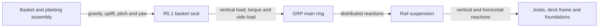

# R5.1 — Open H-cradle basket seat

## Decision status

**R5.1 is the selected basket-seat architecture for survey and prototype. It
is not an accepted fabrication design and does not validate the main rail or
ring, its suspension or the deck.**

R5.1 retains a single-spine seat interface, initially illustrated on the
suspended ring described in [R3-rail.md](R3-rail.md), but replaces R3's two
independently bound crossbars and R5's two basket-sized square plates with an
**open, mechanically captured basket cradle**. In plan, the upper member is
broadly H-shaped: two transverse bearing arms support the basket's reinforced
base bands and a smaller central region connects them over the spine. Two
compact lower bridges capture the rail underside. Four sleeved bolts join the
upper and lower parts beside the rail without drilling or squeezing the hollow
main spine.

The fixed design decision is this open upper member, two lower bridges and
four sleeved bolts arranged as two separated capture stations. It does **not**
fix the rail's outside size. Sleeve length, diameter and position, the spacing
between the two sides of each bolt pair, and the separation of the two stations
may be adapted to the selected rail and checked plate geometry. Changing those
dimensions changes the detailed seat drawing and its local checks, but does
not change the R5.1 architecture.

This document develops the local basket seat only. The predecessor
[R5 — Plates](R5-plates.md) remains the record of the full-square-plate
iteration. Its YAML and renders illustrate the inherited ring and the original
four-bolt capture principle, but they do **not** show the R5.1 plate outline,
bolt positions or lower bridges. Produce a separate editable model after the
actual baskets and candidate plate have been measured.

## Separation of responsibilities

Separating the basket seat from the rest of the carrier is useful because each
part has a different job and different failure modes. It does not mean that
the parts are structurally independent. Loads and movement cross every
interface:

For this iteration:

| Area | Owns | Does not establish |
| --- | --- | --- |
| Basket and planting assembly | Basket-base strength, reinforced bearing bands, internal pot, media retention, crown depth, fish guard, soaked mass and a sound feature for retention | Seat, rail or deck capacity |
| **R5.1 basket seat** | Basket bearing, local pitch/yaw/uplift restraint, seat-to-spine fit, local plate/bolt/sleeve behaviour, movement along the spine, drainage and basket removal | Whole-ring torsion, ring-corner strength or deck capacity |
| GRP main ring | Spine bending and torsion, ring racking, corners, cut-face sealing, flooding and drainage | Suspension or supporting-deck capacity |
| Rail suspension | Ring position, support sharing, horizontal restraint, cord or hanger durability, support-loss behaviour and future replacement | Joist, beam, connector or foundation spare capacity |
| Deck and foundations | Joists, hangers, beams, bracing, slabs, ground and the approved vertical/horizontal load envelope | Adequacy of the basket or its seat |

The boundaries are an engineering aid, not a restriction on later design. A
future bracket could combine seat and suspension functions; a new carrier
could replace the single spine; or a basket could incorporate its own cradle.
Any such proposal must redraw the boundaries and check the new combined load
paths rather than inheriting acceptance from R5.1.

## What R5.1 is intended to improve

Relative to R3's bound crossbars, R5.1 is intended to:

- hold the two basket-bearing regions in one repeatable geometry;
- replace the two crossbar-to-spine cord bindings with mechanical transverse,
  yaw and uplift restraint;
- avoid drilling or locally clamping the selected hollow spine;
- transfer eccentric basket load through an inspectable upper/lower capture;
- make the complete seat removable without opening a ring corner; and
- provide a route to mechanical basket retention with fewer submerged knots.

Relative to R5's full square plates, R5.1 is intended to:

- remove plate that lies outside the necessary bearing and connection paths;
- replace the full lower square with two small bridges used only when uplift or
  overturning engages the rail underside;
- leave most of the basket base open for water exchange and cleaning;
- reduce drained weight, submerged drag, sediment shelves and material cost;
- shorten the length of rail hidden by the seat so supports have more possible
  locations; and
- keep drainage openings away from highly loaded plate regions by creating
  open space rather than drilling a nominal pattern of holes.

These are design intentions to prove in the prototype. Removing material can
increase plate bending and stress around internal corners, so a lighter outline
is not automatically a stronger or acceptable one.

## Proposed arrangement

### Coordinate convention

At one straight side of the ring:

- the **rail direction** runs along the 2,100 mm side;
- the **transverse direction** runs from beneath the deck toward the pond;
- the two basket bearing bands are separated along the rail direction; and
- each bolt station contains one bolt on each transverse side of the spine.

### Upper H member

The upper structural-GRP member comprises:

1. two transverse bearing arms beneath the basket's measured reinforced base
   bands;
2. a central connecting region over the spine; and
3. sufficient local material around the four bolt holes for the selected
   washers, edge distances and load spreading.

The arms need cover only the basket areas capable of carrying load. Their
width, projection and spacing come from the real B23 and B28 bases rather than
their nominal rim sizes. Widen a bearing arm or add a local pad where the
basket needs more load distribution; do not restore a full square by default.

Use generous radii where each bearing arm meets the central region. Sharp
re-entrant corners create stress concentrations and are not acceptable in a
cut GRP H shape. Round, deburr and resin-seal the outside perimeter and every
hole.

A monolithic flat H is the baseline geometry to investigate. A hybrid H, using
two short structural-GRP tubes or bars as the bearing arms and a compact flat
central saddle, is an allowed comparison. The hybrid may provide more bending
stiffness for less material, but it reintroduces arm-to-saddle connections that
need their own broad-bearing detail.

### Lower bridges

Do not use a basket-sized lower plate. Provide two separate lower bridges, one
at each bolt station. Each bridge crosses beneath the spine and joins that
station's two bolts.

The bridges are normally unloaded by gravity. They engage the rail underside
when basket uplift or overturning tries to lift one side of the upper member.
Size them for that reaction, bolt and washer bearing, handling impact and the
agreed connection safety factor. Their outline should expose the remaining
rail underside to water and inspection.

### Bolts and spacer sleeves

Retain four through-bolts as two separated pairs along the rail. One pair alone
would permit much easier yaw and would give poor redundancy. Use provisional
M6 A4/316 hardware only until the actual stack and supplier guidance are
confirmed.

Each bolt passes through the upper member, a smooth rigid sleeve and its lower
bridge. The sleeves:

- set the clear distance between upper and lower parts;
- prevent bolt tightening from pinching the hollow rail;
- sit immediately outside the two rail faces and act as transverse keepers;
  and
- provide a repeatable small running clearance around the actual tube.

The former 38 mm spine and its sleeve layout are a reference arrangement, not
an interface limit. Set sleeve length from the selected rail height and running
clearance. Set the transverse distance between sleeve centrelines from the rail
width, sleeve diameter and running clearance. Set the two along-rail stations
from the basket bearing regions, plate capacity, hole and edge distances, and
the available support bay. A larger or smaller rail therefore remains possible
without changing the seat concept.

Fit the sleeves to a sample of the purchased rail. The former 1 mm side and
underside clearances are starting trial values only. Zero clearance can jam or
preload the rail; excessive clearance permits rocking and impact. Include tube
tolerance, sealed cut surfaces, grit and expected biological growth when
setting the accepted fit.

Place the two bolt stations as close as practical to the two basket bearing
regions so the load path through the upper member is short. Their final
positions must also provide:

- supplier-approved hole and plate-edge distances;
- full washer bearing on sound laminate;
- clearance from the actual tapered basket throughout removal travel;
- clearance from rail supports and ring-corner plates; and
- access to hold both ends of every fastener during assembly and renewal.

Prefer the lower-profile end of the fastener stack on the basket side. Do not
countersink a 6 mm GRP plate merely to hide a bolt head. Use broad washers on
both laminate faces, smooth caps on exposed threads and a specified tightening
procedure. Generic M6 torque is not acceptable: service reactions may be
small, while uncontrolled bolt preload can locally crush the plate beneath a
sleeve or washer.

## Load paths

### Normal gravity

The basket's reinforced base bands bear on the two upper arms. The arms and
central region transfer that load by direct GRP bearing into the flat top of
the spine. Bolts, sleeves and lower bridges are not credited with carrying the
normal centred gravity load.

### Eccentric gravity and pitch

When the basket load moves across the spine, the upper member bears toward one
top rail edge and the opposite lower bridge can engage the rail underside. The
bolts join those two reactions into one cradle. Using the existing provisional
100 N basket load at 50 mm eccentricity, a rigid-body screen gives roughly
182 N at the loaded top edge and 82 N at the opposite underside. These are
useful prototype reactions, not final design loads or plate capacities.

### Yaw and transverse movement

The four sleeves straddle the spine at two stations. Contact between a sleeve
and rail face limits transverse movement; the separation between stations
limits yaw. The detail remains intentionally loose enough to avoid clamping
the spine, so measure the resulting movement rather than claiming zero play.

### Uplift

A basket-retention feature transfers uplift to the upper member. The bolts
then transfer it to both lower bridges, which bear on the rail underside. Test
handling uplift and an uneven one-corner pull; a centred upward test alone does
not exercise the governing local plate and bolt paths.

### Movement along the rail

The sleeved yokes can slide along a smooth spine. **R5.1 does not yet have an
accepted longitudinal stop.** Do not silently retain the R5 cord collars if
the purpose of this iteration is to reduce cord fastening.

Develop and compare one low-load, removable stop such as:

- a broad split collar designed for the hollow GRP profile;
- a rounded GRP stop bonded with a structural system approved by the selected
  GRP supplier for prepared laminate and permanent immersion; or
- a stop integrated with an adjacent accepted suspension fitting where the
  full layout makes that interface sensible.

A split collar still depends on controlled clamping friction, and a bonded
stop depends on surface preparation and peel-resistant geometry. A drilled
pin through every main-spine seat is not the baseline because it creates many
stress concentrations and sealed holes in the primary ring. Prototype the
chosen stop under repeated alternating longitudinal load and deliberate
handling movement.

## Basket retention and depth variants

The cradle must locate the basket independently of the planting media and
must not rely on its top rim or arbitrary fine mesh for gravity support.
Develop mechanical retention around measured sound lower features. Candidate
details include rounded shallow upstands outside the basket base plus one or
two removable broad straps, or reusable smooth clips that spread load across a
reinforced zone. Four cord ties remain an allowed prototype control, not the
preferred R5.1 end state.

Any rigid locator must still allow the basket to move pondward far enough to
clear the deck and then lift without dismantling the ring. Avoid a deep tray
that captures roots or sediment and makes the basket inseparable from its
seat.

R5.1 changes the structural basket bearing; it does not determine every plant
elevation. B23 baskets still need measured height adjustment. The *Butomus*
internal-pot level and crowfoot downstand remain basket/plant details governed
by [plants.md](plants.md). A future depth-adjustable cradle may combine those
functions with R5.1, but this iteration does not claim that development.

Set the top of the accepted bearing arms at the required basket bearing datum.
Derive the main-spine elevation from the actual upper-member thickness and any
deliberate local bearing pad. Do not reuse either R3's 25 mm crossbar offset or
R5's 6 mm plate offset after changing the section.

## Issues owned by the R5.1 seat

The local design remains incomplete until the following are resolved:

1. **Actual basket interface.** Measure base dimensions, reinforced bands,
   taper, deformation, retention features and removal travel for B23 and B28.
2. **Upper-member capacity.** Select plate construction, thickness and fibre
   orientation; check both in-plane directions, arm bending, central-region
   bending, internal-corner stress, holes and wet long-term creep.
3. **Lower-bridge and connection capacity.** Check bridge flexure, bolt
   tension/shear, washer and sleeve bearing, edge distance, through-thickness
   laminate stress, preload and one loosened fastener.
4. **Fit over service life.** Establish an assembly clearance that neither
   rocks excessively when clean nor jams after soaking, grit and biofouling.
5. **Longitudinal restraint.** Select and prove the mechanical or bonded stop.
6. **Basket retention.** Replace or justify the four cord ties without loading
   fragile mesh or preventing independent removal.
7. **Water and maintenance.** Demonstrate open flow around the basket base,
   drainage, access for cleaning and no root or debris trap.
8. **Seat envelope.** Fit every cradle among the actual support wraps, their
   collars or fittings, ring corners, neighbouring baskets and removal routes.
9. **Fish-facing finish.** Round and seal all laminate, sleeves, bridges,
   washers, heads, nuts and threads; leave no crevice or edge that can trap a
   fish, damage the liner or shed fibres.

The original R5 B28 station nearly filled the J3-to-J4 support interval before
the omitted support-wrap collars were included. R5.1 must reduce the length of
rail covered by its central region as well as removing its outer plate area.
An open H whose central web still occupies the former 280 mm length would
improve water flow and weight but would not solve that support-placement
conflict.

## Issues retained by the main ring

The following remain failures or hold points for the overall carrier, but they
are not evidence that one local basket seat is worse than another:

- torsion of the selected single spine under seat torque;
- in-plane ring racking and the bolted mitred-corner response;
- main-member bending, handling strength and support-loss spans;
- selected-profile resin, section tolerances, wet durability and directional
  properties;
- deliberate venting and drainage of every hollow ring side; and
- interaction between seat reactions, corner zones and the full basket layout.

R5.1 must report its vertical loads, horizontal loads and torques to the ring.
The ring must then carry those actions. A well-performing seat cannot validate
the ring, but neither should an unresolved ring question obscure whether R5.1
is a better seat than R3.

## Issues retained by suspension and deck

R5.1 does not resolve:

- equilibrium and whole-ring roll under inclined supports;
- horizontal reactions created by real support angles;
- uneven load sharing, creep, chafe and failure of one support;
- post-deck access and replacement of every upper termination;
- capacity of the joists, hangers, straps, screws, beams and bracing;
- outer-beam uplift, slab/ground bearing or combined deck loading; or
- the five TBC limits in the retained load envelope in
  [design-C.md](design-C.md).

These questions apply equally when the connected single-spine ring carries an
R3 bound seat, an R3 mechanical saddle or R5.1. Recalculate the permanent load
using R5.1's measured mass, but do not require the local seat document to solve
the supporting structure.

R4 remains useful evidence that improving a basket's local bearing does not by
itself establish global equilibrium. Its independent same-bank module lacks an
opposing horizontal reaction. R5.1 does not inherit that particular mechanism
because it remains on the connected R3 ring, whose opposing sides can provide
a complete reaction system if its corners and suspension pass their own tests.

## Prototype sequence

### Stage 1 — measured geometry

1. Buy and measure one B23 and one B28, including loaded base deformation,
   reinforced bands, taper, sound retention zones and removal envelope.
2. Mark the actual rail-support and corner exclusion zones on one full-size
   2,100 mm side.
3. Develop the smallest practical upper outline and two lower bridges around
   those load paths. Record plate orientation and every remaining ligament.
4. Select the candidate longitudinal stop and basket-retention detail; record
   any temporary cord retained solely as a test control.

### Stage 2 — connection coupon

Build one representative sleeved-bolt and lower-bridge connection in the
selected materials. Tighten it using a documented procedure. Inspect for local
indentation, laminate whitening, splitting, washer tilt and permanent set.
Repeat after soaking and after one disassembly/reassembly. Do not infer this
behaviour from bolt tensile capacity.

### Stage 3 — one complete seat

Test one complete B28 cradle over dry ground and then after soaking:

- measured fully soaked out-of-water gravity load;
- 50 mm eccentric load and a deliberately localized bearing-band load;
- pitch, yaw and transverse movement;
- centred and one-corner handling uplift;
- alternating longitudinal force against the selected stop;
- one deliberately loosened fastener;
- repeated basket removal with all real hardware fitted; and
- drainage, cleaning access and inspection after disassembly.

Use about 2 mm initial loaded movement as the existing prototype target, but
define where it is measured and distinguish plate flexure, connection play,
rail rotation and suspension movement.

### Stage 4 — comparative full side

Install four representative stations on the same supported 2,100 mm ring side:
a shallow B23, shallow B28, *Butomus* B28 and crowfoot B23/downstand. Include
all eight real support attachments and their complete lower fittings, one ring
corner and the finished deck-edge mock-up.

Compare R5.1 with an R3 crossbar seat fitted with mechanical keeper cheeks.
Hold basket loads, positions, support geometry and test sequence constant.
Record seat movement separately from spine twist, ring movement and suspension
movement. This comparison selects the basket seat; it does not accept the
whole carrier.

## Acceptance for further development

Advance R5.1 from local prototype to the full-ring candidate only when:

- the measured basket loads bear on defined reinforced regions;
- all local stresses and deformations are checked using documented wet-service
  plate properties and appropriate connection factors;
- no upper arm, bridge, hole, sleeve or washer shows cracking, crushing,
  whitening, elongation or permanent set;
- the seat cannot detach, yaw, migrate or tip into the swimming route under the
  agreed gravity, eccentric, uplift and handling cases;
- the basket remains independently removable beneath the finished deck edge;
- the seat leaves useful water exchange and can be cleaned and inspected;
- its complete envelope fits the issued basket/support/corner layout; and
- its measured mass and reactions are issued to the ring, suspension and deck
  checks.

If R5.1 passes locally but the spine or ring rolls, racks or overloads its
supports, record the seat as successful and redesign the failing carrier area.
Do not reject a sound local cradle merely to preserve a linear revision path.
Equally, do not use a successful local test as evidence that the shared ring
and deck have passed.
