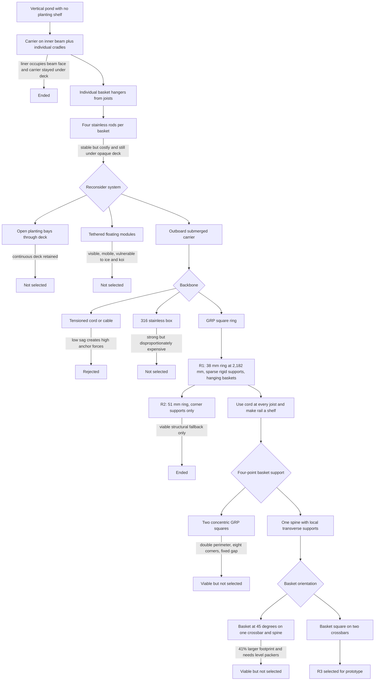
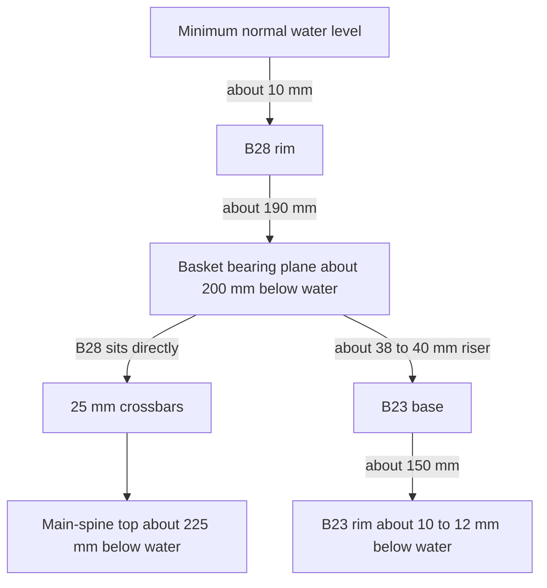

# Pack C submerged planting rail

## Decision status

**R3 is the selected design for survey and prototype. Do not batch-cut or
permanently install it until the hold points in this document have passed.**

R3 is a 2,100 × 2,100 mm centreline square of grey structural-GRP box section,
suspended by cord from every straight joist. Each of the thirteen baskets rests
on two short transverse GRP bars and is tied down at four lower points. The
basket-bearing surface is nominally 200 mm below the minimum normal water level;
B28 baskets sit directly on it and B23 baskets sit on shallow risers.

For a purchasing, fabrication and installation sequence written as a site
guide, use [R3_guide.md](R3_guide.md). This document explains why R3 was chosen
and records its engineering basis.

## Part 1 — Context and design record

### Context and purpose

Design C is a 3.0 × 3.0 m vertical-sided pond within a 5.0 × 5.0 m deck. The
deck projects 350 mm over the pond and leaves a 2.3 × 2.3 m finished opening.
There is no planting shelf, so the rail must create one without touching or
penetrating the liner.

The system must keep the baskets submerged and visually recessive while putting
the plant crowns beyond the opaque deck edge. It must resist basket pitch, roll
and normal water movement; keep koi away from soil and roots; remain liftable
for maintenance; and support the full wet basket mass when the pond is drained.
It is a plant carrier, not a guard rail or a substitute for deck bracing.

Primary geometry sources are [design-C.md](design-C.md),
[option-c-dimensions.md](../../calcs/option-c-dimensions.md),
[design-c-placements.md](../../designs/design-c-placements.md) and
[option-c.yaml](../../../diagrams/specs/option-c.yaml). This document also
records the decisions developed in the
[design discussion](https://chatgpt.com/share/6a983593-962c-83ed-b6dc-8478b204f2a2).

### Requirements and constraints

| Topic            | Requirement                                                                                                                             |
| ---------------- | --------------------------------------------------------------------------------------------------------------------------------------- |
| Capacity         | Carry 13 rail baskets. Check at least four baskets on any one side and replace provisional masses with soaked prototype measurements.   |
| Light            | Put each crown at or beyond the 350 mm deck edge as required by [plants.md](plants.md).                                                 |
| Visibility       | Keep basket bodies and all GRP submerged. Put continuous structure deeper than local structure hidden by baskets.                       |
| Stability        | Avoid unacceptable sag, pitch, roll, crossbar movement, cord creep and chafe.                                                           |
| Water datum      | Work from the measured minimum normal operating level, not a favourable high-water level.                                               |
| Pond safety      | No zinc, lead, sharp cut fibres, projecting threads or debris-catching open channels in the water.                                      |
| Liner and timber | Do not fix through or bear on the liner. Preserve the water-to-timber gap and keep unsuitable deck hardware out of permanent immersion. |
| Service          | Make each basket independently removable and keep joints, cords and seats inspectable.                                                  |
| Drain-down       | Design the rail, cords, seats, joists and deck supports for full soaked out-of-water mass without buoyancy.                             |
| Durability       | Use structural pultruded GRP suitable for continuous immersion, pond-safe cured sealants and A4/316 or 316L wetted metalwork.           |

### Decision history

An end node means that the branch was not selected for this pond, not that the
idea is universally unworkable.



### Why the individual hanger ended

The four-rod arrangement required 52 pad eyes, rods, shackles and lower links
for thirteen baskets. It offered adjustment and good restraint, but it was
costly and inspection-heavy. More importantly, its supports centred the crowns
under 350 mm of opaque decking. Replacing the rods with simple cord slings
reduced hardware but did not move the plants into open light.

### Why a rigid GRP ring won

A horizontal cable is visually slight, but keeping it nearly straight creates
large horizontal reactions. The initial 2.18 m-side screen with four 5 kg loads
gave about 2.7 kN end tension at 20 mm sag, 1.1 kN at 50 mm and 0.54 kN at
100 mm. Separate basket loads also produce kinks, while creep, growth and
biofouling change the geometry.

A square box-section ring provides bending and torsional stiffness, flat
connection faces and no upward-facing debris channel. In R3, cord is used as
many short gravity supports rather than as a highly tensioned horizontal
backbone, so the cable-tension problem does not arise.

Stainless-steel box could perform the same function but was not proportionate
to the loads or budget. Pultruded structural GRP is corrosion-resistant, easily
worked and available in dark grey.

### R1 and R2 historical baselines

R1 used a 2,182 × 2,182 mm centreline ring 409 mm from each pond wall. It was a
38 × 38 × 3.2 mm GRP ring with four corner nodes, one midpoint drop on each
side and hanging basket bridles. At that line, about 174 mm of a B23 and
194–199 mm of a nominal B28 projected beyond the deck edge.

The historical elastic screen for one 2.18 m side carrying four 5 kg baskets
was:

| System                   | Supports                           | Approximate vertical deflection | Historical result |
| ------------------------ | ---------------------------------- | ------------------------------: | ----------------- |
| 38 × 38 × 3.2 mm GRP box | Corners plus one midpoint per side |                          1.2 mm | R1 baseline       |
| 51 × 51 × 3.2 mm GRP box | Corners only                       |                          6.8 mm | R2 fallback       |
| 38 × 38 × 3.2 mm GRP box | Corners only                       |                     About 18 mm | Too flexible      |

R2 therefore retained the ring and hanging concept but used 51 mm GRP and only
corner supports. Both versions became obsolete when the frame was allowed to
take cord support from every joist and the baskets were allowed to bear on it.

The old 409 mm line came from assumed regular joist spacing; it was not an
as-built joist line. The actual first two joist centrelines occur 273.5 and
660.2 mm from the pond wall, and the central pair lie at 1,391.5 and 1,608.5 mm.
R3 therefore treats the rail location as a planting datum and permits its cords
to slope to the real joists.

The earlier suggested rail top 20–30 mm below minimum water also conflicted
with shallow marginals: a hanging basket cannot put its crown above a
tension-only support. Making the frame a bearing shelf allows the continuous
ring to sit much deeper while the internal plant pot controls crown height.

Finally, the historical 5 kg per basket was only a provisional drained wet
mass. It was not the media mass or the apparent underwater load. R3 retains a
10 kg screening load but requires a soaked B23 and B28 to be weighed before
the deck checks are issued.

### ADR: single spine versus concentric squares

Two concentric rings could support each basket directly if their separation
were just under the smallest measured basket base and the rings were tied
together. The branch was not selected because:

- it uses about 16,800 mm of continuous rail instead of 8,400 mm;
- it needs eight corners and a practical four 6 m lengths rather than two;
- one fixed separation must suit both tapered basket bases;
- a representative 150 mm separation gives an outer centreline square near
  2,250 mm, leaving only about 12.5 mm physical clearance per side for a 25 mm
  profile in the 2,300 mm opening; and
- it makes two continuous shallow lines visible.

The single-spine alternative puts the second direction only beneath each dark
basket. Its transverse pieces can be cut to the actual tapered base and can be
replaced independently.

### ADR: square baskets versus 45-degree baskets

A basket turned 45 degrees can place two opposite base corners on one
crossbar and the other two above the spine. This does reduce the number of
crossbars, but not the arm length or torsional demand: half the base diagonal
is √2, or about 1.41 times, the half-width of a square-set basket. The basket
also occupies about 41% more rail length. Because a crossbar laid on the spine
is one section higher than the spine, the other two corners still need packers
or a fabricated flush cross.

The square-set arrangement uses two ordinary parallel crossbars, spreads load
across two base bands, better accommodates a tapered base and avoids special
four-level-point detailing. It is therefore R3's baseline.

## Part 2 — Current R3 design

This part is the current design only. Values marked “nominal”, “starting
detail” or “hold point” must be confirmed through the stated survey or
prototype before batch fabrication.

### Arrangement and datum

- Main-spine centreline: **450 mm from every pond wall**, which is 100 mm
  beyond the 350 mm deck edge.
- Main-spine centreline square: **2,100 × 2,100 mm**.
- Main profile: grey 38 × 38 × 5 mm pultruded structural-GRP SHS. Grey
  38 × 38 × 3.2 mm is an acceptable substitute when available.
- Support: one adjustable 6 mm polyester cord support at every straight joist,
  nominally eight per side and **32 locations** in total.
- Basket seat: two 25 × 25 × 3 mm grey GRP crossbars per basket.
- Retention: four replaceable lower basket ties; no hanging bridle, D-ring or
  self-tapping basket screw.

The rail's 450 mm offset is independent of joist position. J1/J8 provide end
and corner restraint and J2–J7 support the side spans. The maximum internal
as-built joist pitch is about 420 mm. At a corner, the nearest joist cord
accommodates about 176.5 mm along the pond edge and about 100 mm beyond the
joist tip; two adjacent sides provide opposing restraint. No central bridge is
required.

The 2,100 mm ring puts about **215 mm / 94% of a B23** and **235–240 mm /
86–87% of a B28** outside the deck edge. A centred 150 mm plant pot is wholly
beyond the deck with about 25 mm clearance. The basket itself overlaps the
deck by only about 15 mm for B23 and 35–40 mm for B28, preserving useful
central water area without burying the crown in shade.

### Vertical arrangement

Use actual basket measurements in this relationship:

```text
B28 bearing depth = measured B28 height + 10 mm water cover
main-spine top depth = B28 bearing depth + measured crossbar depth
B23 riser height = measured B28 height - measured B23 height
```

With nominal 190 mm B28, 150 mm B23 and 25 mm crossbar dimensions:



The bearing plane is the top of the crossbars, not the top of the main spine.
The continuous spine is therefore about 225 mm below minimum normal water, and
the shallower GRP is local and hidden beneath baskets. Fine crown adjustment is
made inside the basket: shallow B23 crowns project about 7–12 mm above the
outer rim, *Butomus* finishes at or just below the B28 rim, and crowfoot can be
recessed about 10–25 mm below the B23 rim. No plant in the current schedule
needs a hanging seat.

### Basket seats and removal

Buy and measure one B23 and one B28 before cutting crossbars. Supplier widths
usually describe the tapered top, not the load-bearing base.

For each basket:

1. Keep its sides parallel and perpendicular to the spine.
2. Locate two reinforced bands near opposite ends of its base.
3. Cut two 25 × 25 × 3 mm GRP crossbars to the measured base width plus
   10–15 mm projection at both ends, and space them under those bands.
4. Lay the crossbars on the main spine so that they form balanced arms on both
   sides. Bind each crossing firmly with replaceable 3–4 mm polyester cord.
   The GRP carries gravity load by direct contact; the cord prevents sliding,
   rotation and uplift.
5. Put B28 directly on the crossbars. For B23, put one nominal 38–40 mm high,
   approximately 140 mm long GRP riser on each crossbar and capture it with the
   basket tie. Confirm the riser height from the measured basket-height
   difference.
6. Tie the basket to the two bars at four sound lower-mesh areas, one near each
   base corner. Spread each loop over adjacent mesh cells and protect it from
   sharp contact.

The ties retain rather than carry the normal gravity load. If a crossbar moves
in the dry test, bind a small rounded GRP or HDPE stop immediately to each side
of the spine; the stops act as fences and do not replace the binding.

To remove a basket, undo or cut its four ties, move it approximately 20–50 mm
pondward until the landward rim clears the deck and lift it. Confirm the exact
travel using the purchased basket. Self-tapping screws through plastic mesh are
not acceptable: they concentrate load, expose threads and obstruct servicing.

### Joist-to-spine cord supports

Provide one independently adjustable support at every straight joist. Use
nominal 6 mm black low-stretch braided polyester with a published minimum
breaking load of at least 6 kN. Protect the cord at both timber and GRP contact
with smooth replaceable sleeves or pads.

Where access permits, pass the cord twice around the joist and twice around the
spine, then use a secure backed knot. Fit a small independent A4 keeper and
large washer to the underside of the joist near its end so the upper loop
cannot walk off; the cord around the timber is the load path and the keeper is
only a stop. If an upper loop cannot be installed before decking closes access,
design an A4 through-fastened termination rather than forcing cord through a
gap or relying on friction at a free timber end.

Place lower wraps between basket crossbars where possible and prevent them
from migrating along the box section. Bind one tight 3–4 mm polyester cord
collar immediately to each side of every lower wrap; the collars are simple
fences and do not carry the vertical reaction. Tension the main supports only
enough to remove slack and level the shelf. This is gravity suspension, not a
prestressed net.

A side with four 10 kg screening baskets plus about 5–6 kg of drained rail and
seats averages roughly 60 N per support across eight joists. Use **0.3 kN per
completed support** as the preliminary proof value to cover uneven sharing and
one slack adjacent cord. Cord strength alone is not connection capacity: knot,
wet ageing, chafe and the completed termination must be included in the test.

### Main-ring corners

Use a 45-degree mitre at each main-spine corner and sandwich it between one
top and one bottom L-shaped plate cut from **6 mm structural GRP plate with
documented in-plane properties in both directions**. If the plate is pultruded
and therefore directionally stronger, turn the top and bottom plate fibre
directions through 90 degrees and obtain the supplier's approval for the
cross-axis use. The current prototype starting detail is:

- eight L plates, each 170 × 170 mm overall with 50 mm-wide arms;
- four M6 A4/316 through-bolts per corner, two along each rail leg;
- bolt centrelines about 60 and 120 mm from the theoretical corner along each
  leg, centred across the 38 mm rail face; and
- large A4 flat washers and A4 all-metal locking nuts, with every exposed end
  smoothly capped.

Each bolt passes through the top plate, both walls of the square tube and the
bottom plate. Clamp the dry square flat, drill a close but free clearance hole
using backing to prevent breakout, deburr it and seal every exposed cut face.
The plates distribute local bearing and prevent the mitred sides from yawing or
racking during lowering. Keep crossbars outside the plated corner zones.

These dimensions are suitable for a full-size prototype, not a substitute for
the selected profile supplier's connection guidance. Confirm bolt clearances,
edge distances, tightening torque, plate grade and joint proof response before
batch fabrication. Through-bolts and both plates are the primary load path;
do not tap load-bearing threads into GRP.

Gold Label Pond & Aquarium Sealer may be applied as an **optional 2–5 mm
external perimeter fillet** where each plate meets the tube after the bolts are
tightened. This can exclude debris, damp rattling and provide uncredited
secondary restraint. Do not put a thick bead between the clamped structural
faces: the manufacturer describes Gold Label as a sealant rather than a glue
and requires a body of material instead of a compressed-flat joint. It has no
published structural design strength for this connection, so the corner must
pass without counting it. Abrade and clean the smooth GRP first and allow the
fillet to cure in accordance with the current instructions before fish can
reach it.

If a structural adhesive is later wanted in addition to the bolts, use only a
two-part product approved by the selected GRP supplier for prepared pultruded
GRP, the joint gap and permanent immersion. That is a separate joint option;
do not substitute Gold Label for it.

### Cut surfaces, flooding and fish-facing finish

Round and deburr all cuts and holes, remove dust, then coat exposed fibres with
the selected GRP supplier's compatible catalysed resin or immersion-approved
two-part coating. Cure it completely before pond contact. A flexible silicone-
type sealant is not a replacement for this resin seal because it does not
restore the profile's resin-rich cut surface.

Every hollow member must fill and drain freely so it cannot float or retain
stagnant water. Do not seal tube ends airtight with Gold Label. Use either a
smooth resin-sealed open end protected by a securely retained coarse HDPE
guard, or a rounded perforated cap with a deliberate upper vent and lower
drain. Inspect each piece in a test tub and reject any persistent air pocket.

Gold Label is suitable as an optional cured fish-facing fillet or protective
cap over an already resin-sealed edge. Abrade clean fibreglass first. Keep any
uncured material away from fish, follow the current temperature/cure
instructions and preserve all vent and drain paths.

### Preliminary member screening

With every joist used, the preliminary main-span screen is 420 mm rather than
1.09 or 2.18 m. The calculation uses a conservative 100 N point load at
midspan, simple supports, longitudinal modulus E = 17 GPa and no benefit from
the connected ring.

| Grey GRP SHS       |     Geometric I | Midspan deflection | Bending stress | R3 use                                                                        |
| ------------------ | --------------: | -----------------: | -------------: | ----------------------------------------------------------------------------- |
| 25 × 25 × 3 mm     |      21,692 mm⁴ |           0.419 mm |       6.05 MPa | Crossbars; main-ring economy option only after separate handling/joint review |
| 38 × 38 × 3.2 mm   |      90,668 mm⁴ |           0.100 mm |       2.20 MPa | Main ring when grey stock is available                                        |
| **38 × 38 × 5 mm** | **122,540 mm⁴** |       **0.074 mm** |   **1.63 MPa** | **Buy-now main-ring selection**                                               |

The 25 mm crossbar screen uses a 150 mm arm carrying 25 N and gives about
0.076 mm tip deflection and 2.16 MPa bending stress. The real tapered base
should shorten the arm, so mesh condition, local bearing and the ties are more
likely to govern the seat prototype than elastic GRP bending.

These are preliminary elastic checks, not a certified structural design.
Confirm actual modulus, section tolerances, long-term immersion suitability and
manufacturer connection guidance. Recalculate if any main support span exceeds
420 mm or the heaviest soaked basket exceeds 10 kg.

### Geometry for lowering the complete empty assembly

A 2,100 mm centreline ring made from 38 mm SHS is about 2,138 mm over its outer
faces, leaving roughly 81 mm clearance per side inside the 2,300 mm opening.
Basket crossbars project beyond this, and opposed nominal B28 baskets make an
overall envelope around 2,380 mm.

Because the decking is not installed, the ring, seats and **empty baskets** may
be lowered together if a full dry trial proves that every basket passes between
joists:

| As-built clear joist bay | Basket which may pass during lowering     |
| -----------------------: | ----------------------------------------- |
|        339.7 or 372.9 mm | B23 or B28                                |
|                 264.4 mm | B23 only, after measuring basket and ties |
|     170.0 mm central bay | Neither                                   |

Use four temporary control lines and allow a controlled small translation or
tilt while basket rims pass the joist tips. Do not add LECA, gravel, filled
pots, loam or plants until the frame is supported and level in the pond. If the
trial is awkward or catches the liner, lower the bare ring and fit the modular
seats and baskets afterwards.

### Component schedule

Buy one sample of each basket first. Crossbar and riser lengths depend on their
actual tapered bases and heights.

| Component | Current allowance |
| --- | --- |
| Main spine | Four sides forming a 2,100 mm centreline square in grey 38 × 38 × 5 mm structural GRP SHS; **2 × 6 m lengths**. With the selected 45-degree mitres, each side is nominally **2,138 mm long-point to long-point**. Grey 38 × 38 × 3.2 mm is an acceptable stock substitute. Confirm the trial corner before batch cutting. |
| Crossbars | **26** in grey 25 × 25 × 3 mm structural GRP SHS, each measured base width + 20–30 mm. One 6 m length may suffice; total measured cuts and kerfs first. |
| B23 risers | **20**, nominally 38–40 mm high × about 140 mm long, normally cut from main-profile offcuts. |
| Corner plates | **8** 170 × 170 × 6 mm L plates with 50 mm arms, cut from structural GRP plate with documented properties in both in-plane directions. A minimum 400 × 800 mm blank gives a simple trial cutting layout. If pultruded, pair top/bottom strong directions at 90 degrees. |
| Corner bolts | **16 × M6 × 70 mm A4/316** through-bolts as the purchasing allowance, **32 large A4 washers**, **16 A4 all-metal locknuts** and smooth thread caps; verify the exact grip length on the trial stack and follow supplier joint guidance. |
| Main support cord | **32 supports**; allow 60 m of 6 mm black low-stretch braided polyester, MBL at least 6 kN, then revise from one full-size support mock-up. |
| Joist keepers and chafe protection | 32 non-load-bearing A4 keeper sets plus replaceable smooth protection at every timber and GRP cord contact. |
| Seat and location cord | Allow **120 m** of 3–4 mm black braided polyester, MBL at least 1.5 kN, for 26 crossbar bindings, 52 basket ties and 64 main-support location collars; revise from the complete mock-ups. This is separate from 2 mm lid lacing. |
| Crossbar stops | Rounded GRP or pond-safe HDPE blocks and cord as required by the dry movement test. |
| Cut-face coating | Compatible catalysed resin or two-part coating approved for the selected GRP and immersion. |
| Optional perimeter sealant | One cartridge of black Gold Label Pond & Aquarium Sealer for external fillets and protective caps only; not included in structural strength. |
| Rail baskets | **10 B23 and 3 B28**, completed after rail installation to [plants.md](plants.md). |

Two 6 m main lengths leave about 3,448 mm before saw kerfs after four nominal
2,138 mm mitred sides. Twenty nominal 140 mm B23 risers use about 2,800 mm, so
the offcut strategy is plausible but must be set out before cutting.

Do not use galvanised wetted brackets, sealed hollow rail, decorative
fibreglass, upward-facing open channel, exposed cut GRP, unrestrained hooks or
cord with no published strength.

### Survey, prototype and issue sequence

1. Buy and measure one B23 and B28: top, base, height, reinforced base bands
   and sound lower tie positions.
2. Survey pond walls, finished deck edge, liner face, all joist faces and tips,
   existing fixings and minimum/normal/maximum water levels.
3. Set out the 450 mm centreline square and confirm exposure, lowering bays and
   the inward travel needed to lift each basket.
4. Make and load-test one complete B23 seat and one B28 seat over dry ground.
5. Make one full joist support and prove the wrap, adjustment, keeper and chafe
   protection at 0.3 kN.
6. Fabricate one bolted corner and proof it for joint slip, local crushing and
   racking, including handling of the assembled ring.
7. Build, soak and vent one representative B23 and B28; record apparent
   underwater weight and fully soaked out-of-water mass.
8. Assemble one full rail side at 420 mm maximum support pitch with four
   representative drained loads, the actual cord drop and one corner.
9. Measure vertical movement, translation, yaw, cord stretch/chafe, crossbar
   movement, basket pitch and removal travel. Inspect every contact afterwards.
10. Add the measured rail and basket reactions to the joist, inner connection,
    outer uplift and foundation/pad checks.
11. Issue the final cut list, support-length list, basket-position drawing,
    corner detail and signed inspection record before batch fabrication.

### Acceptance checks

- All basket rims and GRP remain submerged at minimum normal water; target at
  least 10 mm cover over the highest outer rim.
- Every scheduled crown reaches its depth in [plants.md](plants.md) without a
  hanging basket.
- Initial loaded vertical movement, including cord stretch and joint slip,
  meets the agreed target; use about 2 mm as the prototype target.
- No basket, riser or crossbar can slide, tip into the swimming route or detach
  under handling and temporary uplift.
- Each basket can move inward past the deck edge and lift without removing the
  ring.
- Every hollow piece floods and drains with no persistent trapped-air uplift.
- Fish and liner can touch no sharp edge, exposed fibre or projecting thread.
- The bolted corner meets the proof test without cracking, hole elongation,
  plate lift or permanent racking; it must pass without credit for Gold Label.
- Fully soaked drain-down loads appear in the final deck calculation.
- Every joint, support, binding and basket tie remains visible and replaceable.

### Source trail

The following sources inform material selection and fabrication practice:

- [Fiberline fish-farming GRP applications](https://fiberline.com/solutions/fish-farming)
- [Fiberline machining and bolted-joint guidance](https://fiberline.com/how-to-videos)
- [Strongwell FRP fabrication and repair manual](https://www.strongwell.com/wp-content/uploads/2024/10/Strongwell-Fabrication-and-Repair-Manual.pdf)
- [25 × 25 × 3 mm grey GRP hollow section](https://www.fhbrundle.co.uk/products/3305253GY__GRP_Hollow_Section_25_x_25_x_3mm_x_6m_Grey)
- [38 × 38 × 3.2 mm grey GRP hollow section](https://www.fhbrundle.co.uk/products/33053832GY__GRP_Hollow_Section_38_x_38_x_3.2mm_x_6m_Grey)
- [38 × 38 × 5 mm grey GRP hollow section](https://www.fhbrundle.co.uk/products/3305385GY__GRP_Hollow_Section_38_x_38_x_5mm_x_6m_Grey)
- [F.H. Brundle GRP property data](https://samsara-web.s3-eu-west-1.amazonaws.com/webimages/3306313Y/Technical%20Documents/GRP%20Property%20Data.pdf)
- [Gold Label manufacturer FAQ](https://www.huttonaquaticproducts.co.uk/faqs/)
- [Example 6 mm polyester rope data](https://shop.marlowropes.com/blue-ocean-d-3-braid-6mm-grey-200mr-kb4492)
- [B23 supplier example](https://www.pondkeeper.co.uk/pondxpert-medium-square-planting-basket-23-x-15cm/)
- [B28 supplier example](https://www.pondkeeper.co.uk/pondxpert-large-square-planting-basket-27-x-19cm/)

Supplier listings establish examples and nominal dimensions only. Obtain the
selected manufacturer's current structural properties, resin/environment data,
product instructions and connection guidance for the issued design.
